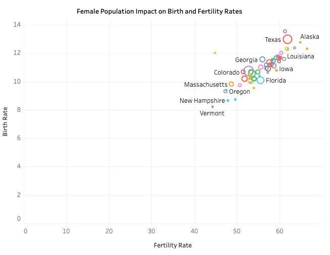

# Demographic Analysis of U.S. States

This project presents a deep dive into the demographic trends across U.S. states. Focusing primarily on births, fertility rates, and regional distributions, the visualizations rendered using Tableau offer intuitive insights into the data, highlighting unique patterns and observations.

# Key Features

Interactive U.S. Map: 

Hover over individual states to view detailed demographic statistics.

Births and Total Population Scatterplot: 

Analyze the relationship between total population and births

Birth and fertility scatterplot: 

Analyze female population impact on Birth and fertility rates

# Dataset: 

Source: CDC at this link: https://wonder.cdc.gov/controller/datarequest/D149;jsessionid=E034ACECDA6A896EB6D74ED77401

Attributes: Covers key demographic details such as birth numbers, fertility rates, total population

# Usage: 

To explore the Dashboard, Click on the following link:

https://public.tableau.com/app/profile/mohammed1559/viz/Health_16977634549030/Dashboard1?publish=yes

Do note to view the dashboard in full screen to get a better experience 

# Screenshots: 

