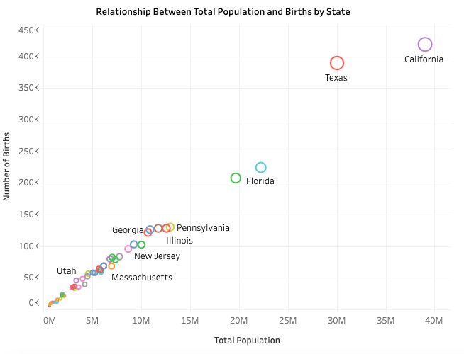

# Demographic Analysis of U.S. States

This project presents a deep dive into the demographic trends across U.S. states. Focusing primarily on births, fertility rates, and regional distributions, the visualizations rendered using Tableau offer intuitive insights into the data, highlighting unique patterns and observations.

# Key Features

Interactive U.S. Map: 

Hover over individual states to view detailed demographic statistics.

Births and Total Population Scatterplot: 

Analyze the relationship between total population and births

Birth and fertility scatterplot: 

Analyze female population impact on Birth and fertility rates

# Dataset: 

Source: CDC at this link: https://wonder.cdc.gov/controller/datarequest/D149;jsessionid=E034ACECDA6A896EB6D74ED77401

Attributes: Covers key demographic details such as birth numbers, fertility rates, total population

# Usage: 

To explore the Dashboard, Click on the following link:

https://public.tableau.com/app/profile/mohammed1559/viz/Health_16977634549030/Dashboard1?publish=yes

Do note to view the dashboard in full screen to get a better experience 

# Screenshots: 

# Insights & Observations

High Female Population & Moderate Rates: California and Texas have large circles (indicating high female populations) and are positioned in the middle ground for fertility and birth rates.

Average Female Population & Varied Rates: States like Illinois, Colorado, and Louisiana have medium-sized circles and are spread across the scatterplot, indicating varied fertility and birth rates for states with similar female population sizes.

Big Observation: Higher female population does not mean higher fertility and birth rates. For example, Utah has the highest birth rates despite having a female population way lower than most major states such as Texas

The second scatterplot: 

High population: The more people that reside in the state the higher the number of births will be. This is shown by the linear relationship and hovering over the dots on the scatterplot.

# Future Enhancements: 

Future Enhancements

Integrate additional demographic variables such as income levels, education metrics, and more to enrich the analysis.

Develop year-on-year comparison dashboards to track evolving trends.

